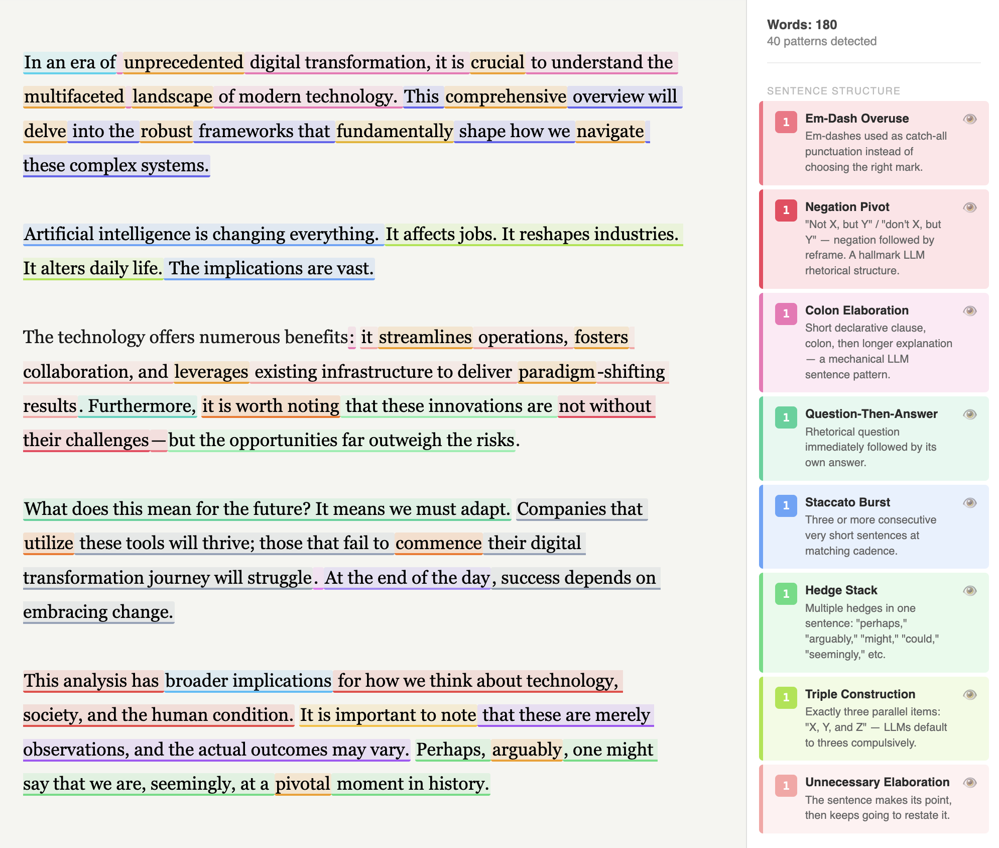

#  Slop Cop

A browser-based editor that detects the rhetorical and structural tells of LLM-generated prose — and highlights them in real time.

**[https://awnist.com/slop-cop](https://awnist.com/slop-cop)**


This repo is a combination of many slop detection tools. Built off the backbone of [Slop Cop](https://github.com/awnist/slop-cop)




## What is "Slop"? 

Just use the tool and find out. You know it when you see it. Unless... you are a filthy [clanker](https://en.wikipedia.org/wiki/Clanker). Slop is the lack of humanity in the text. 

"Slop" is the way things are phrased. It just sounds like AI.

## Why would we want to detect slop?

As a writer, I'm getting tired of reading slop. Of thinking in slop. It's the way every thought is processed. The way the AI speaks. I've devloped this tool as a way to quantifiably detect and label slop. In a objective way. Something I can point to and say Look! There it is. There's the slop. 

## What is the use case for Slop Cop?

This is not a plagiarism detector. This software is not used to detect whether text was written by an AI. It's just used to detect slop in writing. 

This tool is not made to detect slop in programming, which is a entirely separate but related issue.


## How it works

Detection runs in two tiers:

**Client-side (instant):** 36 rules implemented as regex and structural analysis. Fire on every keystroke after a 350ms debounce. No API key needed.

**Semantic (optional):** Two parallel calls to the configured LLM (Anthropic, OpenAI, or a local model), triggered manually:

- *Fast pass* — Claude Haiku (~5s): sentence and paragraph-level patterns that require language understanding (sycophantic framing, unnecessary elaboration, etc.). Large documents are automatically split into overlapping chunks and analyzed in parallel for better coverage.
- *Deep pass* — Claude Sonnet (~15s): document-level patterns only visible at scale (dead metaphor repetition, one-point dilution, fractal summaries)

API calls go directly from your browser to the provider you choose (Anthropic, OpenAI, or a local server). No server on our end. Your key is stored in `localStorage` and never leaves your machine.

## Patterns detected

### Client-side (instant)


| Pattern                   | What it catches                                                                                                       |
| ------------------------- | --------------------------------------------------------------------------------------------------------------------- |
| Overused Intensifier      | `crucial`, `robust`, `pivotal`, `unprecedented`, `tapestry`, `nuanced`, `paradigm`, `leverage`, `delve`, and ~15 more |
| Elevated Register         | `utilize` → use, `commence` → start, `facilitate`, `endeavor`, `demonstrate`, `craft`, `moving forward`               |
| Filler Adverb             | Sentence-opening `importantly`, `ultimately`, `essentially`, `fundamentally`                                          |
| "Almost" Hedge            | `almost always`, `almost certainly`, `almost never`                                                                   |
| Era Opener                | `In an era of…`, `In a world where…`                                                                                  |
| Metaphor Crutch           | `double-edged sword`, `game changer`, `north star`, `deep dive`, `paradigm shift`, `perfect storm`, and more          |
| "It's Important to Note"  | `it is important to note`, `it's worth noting`, `it should be noted`                                                  |
| "Broader Implications"    | `broader implications`, `wider implications`                                                                          |
| False Conclusion          | `In conclusion`, `At the end of the day`, `To summarize`, `Moving forward`                                            |
| Connector Addiction       | Paragraph-opening `Furthermore`, `Moreover`, `Additionally`, `However`, `That said`                                   |
| Unnecessary Contrast      | `whereas`, `as opposed to`, `in contrast to`, `unlike`                                                                |
| Em-Dash Overuse           | Excessive em-dash (`—`) and en-dash (`–`) pivots                                                                     |
| Negation Pivot            | `not X, but Y` / `not X — Y` constructions                                                                            |
| Colon Elaboration         | Short setup clause followed by long elaboration via colon                                                             |
| Parenthetical Qualifier   | Long parentheticals and comma-bracketed hedges (`of course`, `to be fair`, `admittedly`)                              |
| Question-Then-Answer      | Rhetorical question immediately answered in the next sentence                                                         |
| Hedge Stack               | Multiple epistemic hedges in a single sentence (`perhaps`, `might`, `arguably`, `seemingly`)                          |
| Staccato Burst            | Three or more consecutive short sentences used for dramatic effect                                                    |
| Listicle Instinct         | Bullet or numbered lists with exactly 3, 5, or 7 items                                                                |
| "Serves As" Dodge         | `serves as`, `stands as`, `acts as`, `functions as`                                                                   |
| "Not X. Not Y. Just Z."   | Consecutive negation sentences building to a reveal                                                                   |
| Anaphora Abuse            | Three or more consecutive sentences with the same opener — any non-function word (single or two-word); leading conjunctions like "And" stripped before matching |
| Gerund Fragment Litany    | Consecutive short sentences starting with gerunds                                                                     |
| "Here's the Kicker"       | `Here's the thing`, `Here's the kicker`, `Here's where it gets interesting`                                           |
| Pedagogical Aside         | `Let's break this down`, `Let's unpack`, `Think of it as`                                                             |
| "Imagine a World Where"   | Hypothetical world-building openers                                                                                   |
| Listicle in a Trench Coat | Prose disguising a list via ordinal sentence starters (`The first…`, `The second…`)                                   |
| Vague Attribution         | `experts argue`, `studies show`, `research suggests`, `many believe`                                                  |
| Bold-First Bullets        | Bullet items formatted `**Term**: explanation`                                                                        |
| Unicode Decoration        | `→` used as a stylistic bullet or transition                                                                          |
| "Despite Its Challenges"  | `Despite these challenges`, `Despite its limitations`                                                                 |
| Invented Concept Label    | `the [word] paradox/trap/vacuum/inversion/chasm` — fake conceptual branding                                           |
| Dramatic Fragment         | One-to-four-word standalone paragraph used for emphasis                                                               |
| Superficial Analysis      | `, [participle] its/the/their/this [importance/role/significance]` — empty summarizing phrase                         |
| False Range               | Hollow `from X to Y` constructions; `doesn't emerge from nowhere`                                                     |
| Triple Construction       | Exactly three parallel items: `X, Y, and Z` — the LLM default                                                        |
| Short-Hook Paragraph      | Short punchy opener (≤10 words) followed by two or more substantially longer elaboration sentences                    |
| Significance Phrase       | `plays a key role`, `sheds light on`, `paves the way`, `sets the stage` — inflating significance without substance    |
| Exemplar Cliché           | `textbook example`, `classic example of`, `prime example`, `poster child` — labelling proof without arguing why       |
| Chatbot Artifact          | `I hope this helps`, `feel free to`, `great question`, `don't hesitate to ask` — conversational scaffolding in prose  |


### Semantic — fast pass (Claude Haiku or GPT-4.1 mini)

Throat-Clearing Opener · Sycophantic Frame · Balanced Take · Unnecessary Elaboration · Empathy Performance · Pivot Paragraph · Grandiose Stakes · Historical Analogy Stack · False Vulnerability

### Semantic — deep pass (Claude Sonnet or GPT-4.1)

Dead Metaphor · One-Point Dilution · Fractal Summaries

## Running locally

```bash
pnpm install
pnpm dev        # localhost:5173
pnpm build      # type-check + production build
pnpm test       # client-side unit tests (299 tests, no API key needed)
pnpm test:llm   # LLM integration tests (requires ANTHROPIC_API_KEY in .env)
```

The editor is a `contenteditable` div with a custom undo/redo stack. Native browser undo is destroyed by `innerHTML` replacement, so undo history is maintained in refs and intercepted via `keydown`.

## Source rules

The pattern taxonomy draws from several sources:

- [LLM_PROSE_TELLS.md](https://git.eeqj.de/sneak/prompts/src/branch/main/prompts/LLM_PROSE_TELLS.md) (sneak, MIT) — the primary rule catalogue
- [Wikipedia: Signs of AI Writing](https://en.wikipedia.org/wiki/Wikipedia:Signs_of_AI_writing) (CC BY-SA 4.0)
- [tropes.md](https://tropes.fyi/tropes-md)

## Related tools

- [eqbench/slop-score](https://github.com/sam-paech/slop-score) — in-browser slop scorer with a frequency-ratio word list built against human writing baselines; live at [eqbench.com/slop-score.html](https://eqbench.com/slop-score.html)
- [sam-paech/slop-forensics](https://github.com/sam-paech/slop-forensics) — dataset generation and analysis toolkit for profiling LLM slop across models; produces the canonical slop lists used by slop-score
- [gabelul/slopbuster](https://github.com/gabelul/slopbuster) — Claude Code / Codex skill that pipes prose through a two-pass audit (pattern removal + voice injection)
- [QRY91/slopsquid](https://github.com/QRY91/slopsquid) — Go CLI that scans files and websites using frequency-ratio data from the Antislop paper
- [iwalton3/sycofact](https://huggingface.co/iwalton3/sycofact) — Gemma 3 4B fine-tune for detecting sycophancy and unsafe AI outputs
- Paech et al., 2025 — [Antislop: A Comprehensive…](https://arxiv.org/abs/2501.01345) — the research paper underlying the frequency-ratio approach